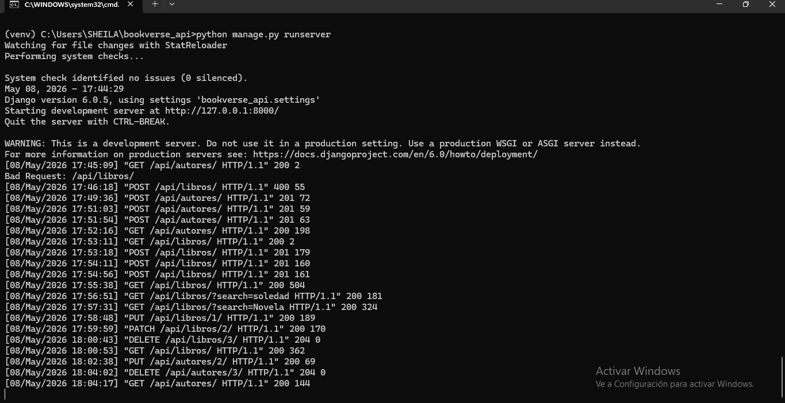
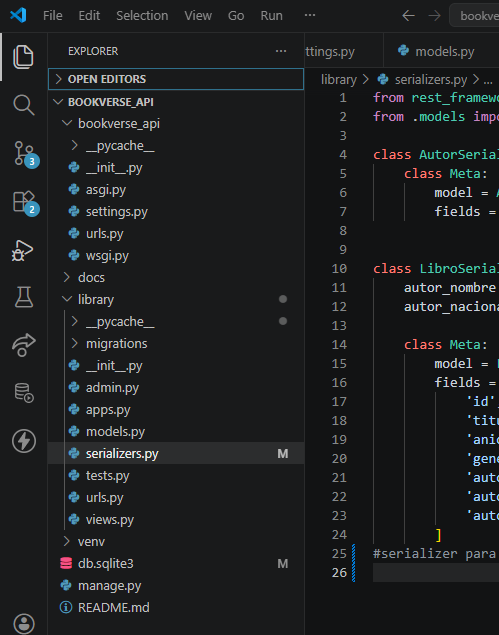
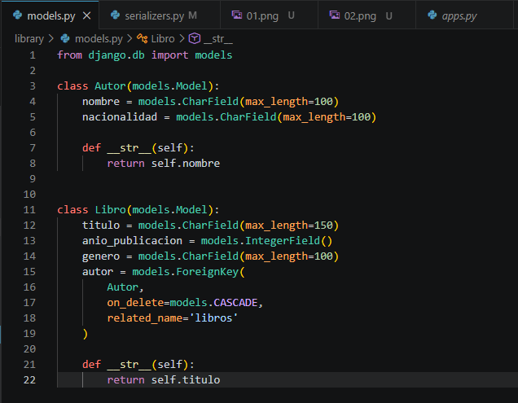
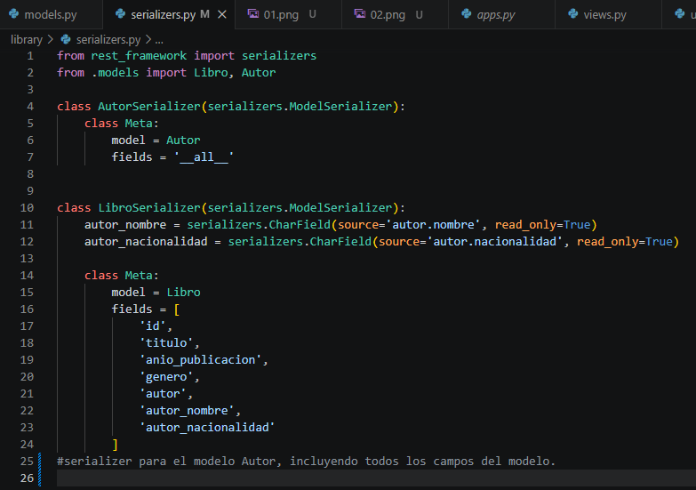
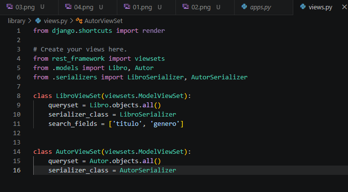
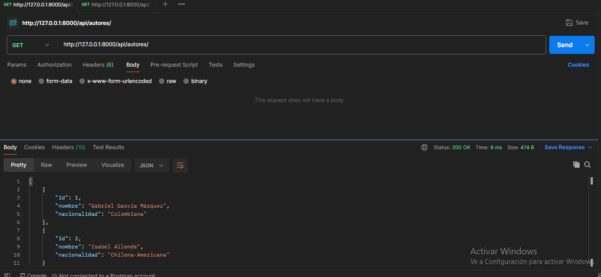
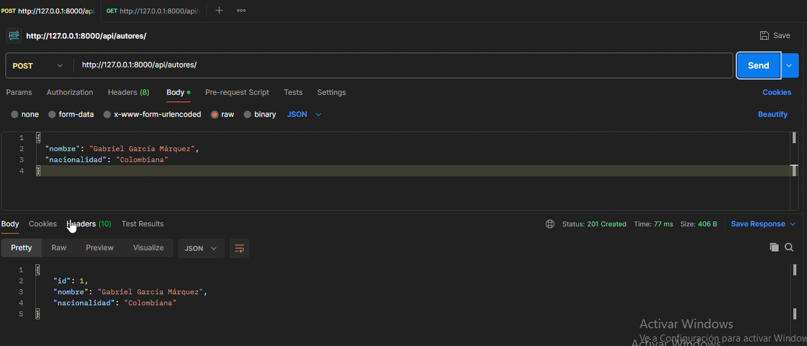
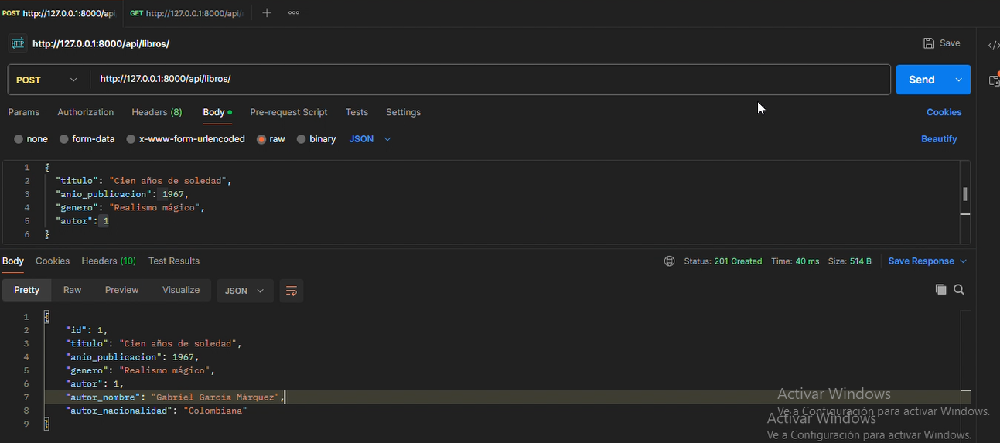
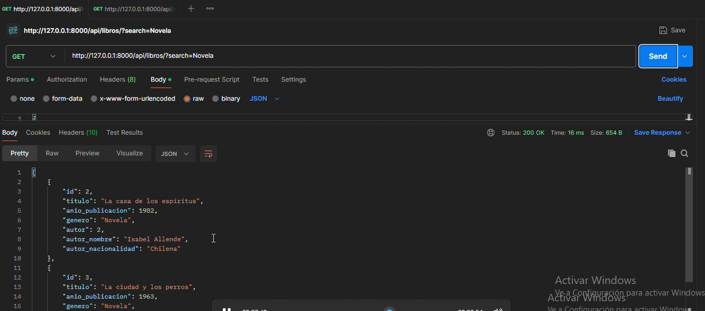
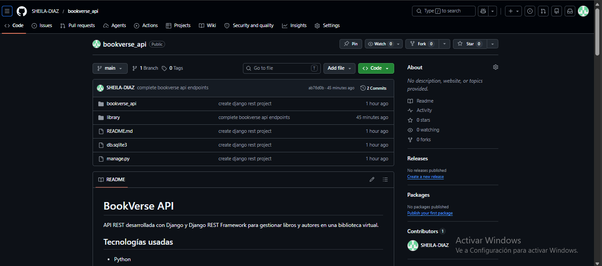

# BookVerse API

API REST desarrollada con Django y Django REST Framework para gestionar libros y autores en una biblioteca virtual.

## Tecnologías usadas

- Python
- Django
- Django REST Framework
- SQLite
- Postman

## Ejecutar servidor

```bash
python manage.py runserver
```

## Endpoints

### Autores

- GET `http://127.0.0.1:8000/api/autores/`
- POST `http://127.0.0.1:8000/api/autores/`
- PUT `http://127.0.0.1:8000/api/autores/1/`
- DELETE `http://127.0.0.1:8000/api/autores/1/`

Ejemplo POST Autor:

```json
{
  "nombre": "Gabriel García Márquez",
  "nacionalidad": "Colombiana"
}
```

### Libros

- GET `http://127.0.0.1:8000/api/libros/`
- POST `http://127.0.0.1:8000/api/libros/`
- PUT `http://127.0.0.1:8000/api/libros/1/`
- DELETE `http://127.0.0.1:8000/api/libros/1/`

Ejemplo POST Libro:

```json
{
  "titulo": "Cien años de soledad",
  "anio_publicacion": 1967,
  "genero": "Realismo mágico",
  "autor": 1
}
```

## Búsqueda

- GET `http://127.0.0.1:8000/api/libros/?search=soledad`
- GET `http://127.0.0.1:8000/api/libros/?search=Realismo`

## Relación entre entidades

Cada libro está relacionado con un autor.

La respuesta del endpoint de libros muestra:

```json
{
  "autor_nombre": "Gabriel García Márquez",
  "autor_nacionalidad": "Colombiana"
}
```

## Capturas del Proyecto

### 01.png → Servidor Django

Descripción:
Servidor Django ejecutándose correctamente con `python manage.py runserver`.



---

### 02.png → Estructura del Proyecto

Descripción:
Estructura general del proyecto en Visual Studio Code.



---

### 03.png → Models

Descripción:
Archivo `models.py` mostrando las entidades Autor y Libro.



---

### 04.png → Serializers

Descripción:
Archivo `serializers.py` mostrando los serializers de Autor y Libro.



---

### 05.png → Views

Descripción:
Archivo `views.py` mostrando los ViewSets implementados con Django REST Framework.



---

### 06.png → GET Autores

Descripción:
Prueba del endpoint GET `/api/autores/` en Postman.



---

### 07.png → POST Autor

Descripción:
Creación de un autor mediante endpoint POST.



---

### 08.png → POST Libro

Descripción:
Registro de un libro relacionado con un autor.



---

### 09.png → Search Libro

Descripción:
Búsqueda de libros usando `?search=`.



---

### 10.png → GitHub

Descripción:
Repositorio GitHub del proyecto mostrando commits y README.



## Video YouTube

Pendiente

## GitHub

Pendiente